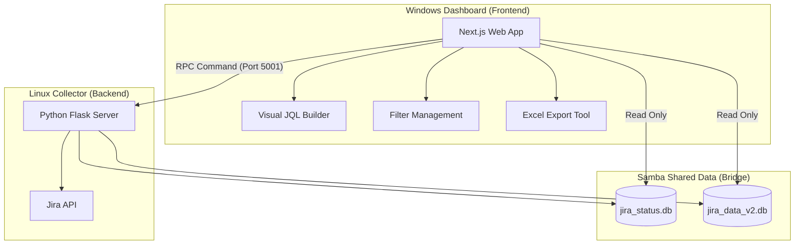

# JiraAnal Web Dashboard

이 프로젝트는 Jira 데이터를 수집하고 시각화하여 작업을 분석하는 도구입니다. 리눅스 환경의 Jira 수집기(Python)와 윈도우 환경의 대시보드(Next.js)가 유기적으로 연동되는 하이브리드 아키텍처를 가집니다.

## 🏗️ 시스템 아키텍처 (Hybrid RPC)



## 🌟 주요 기능

1. **지능형 JQL 필터 빌더**: UI 기반으로 복잡한 JQL 조건을 생성하고, 필터별로 수집 설정을 관리합니다.
2. **필터 관리소**: 저장된 필터의 수정, 삭제, 상세 정보 확인 및 빌더로의 즉시 연동을 지원합니다.
3. **수집 이력 및 통계**: 수집된 회차별로 참여 인원, 투입 공수(M/M), 이슈 비중 등을 시각화합니다.
4. **고급 엑셀 내보내기**: 상세 내역뿐만 아니라 개요, 작업자별 통계, 월별 추이 등을 포함한 **멀티 시트 엑셀** 다운로드를 지원하며, 숫자 데이터 타입을 보존하여 즉각적인 분석이 가능합니다.

## 🚀 운영 가이드

### 1단계: 서버 구동 (Linux/Samba 환경)
리눅스 서버에서 RPC 서버(`server.py`)가 실행 중이어야 웹 대시보드에서 수집 명령을 내릴 수 있습니다.
```bash
# 리눅스 터미널
cd z:/workspace/webApps/JiraAnal_New/collector
python3 server.py
```

### 2단계: 대시보드 실행 (Windows 환경)
로컬 폴더에서 개발 서버를 구동합니다.
```powershell
cd D:\works\JiraAnal_Web
npm run dev
```
접속 주소: [http://localhost:3000](http://localhost:3000)

## 🛠️ 개발 및 관리 수칙

- **형상 관리**: `D:\works\JiraAnal_Web`에서 로컬 작업을 진행하며, 수정 완료 후 `Git Push`를 통해 형상을 보존합니다.
- **데이터 실시간성**: Samba 환경의 특성을 고려하여 `getDb()` 호출 시 캐시를 제거하고 매번 최신 데이터를 읽어오도록 구현되어 있습니다.
- **의존성**: 새로운 UI 컴포넌트 추가 시 `Shadcn/UI` 프레임워크를 활용합니다.
