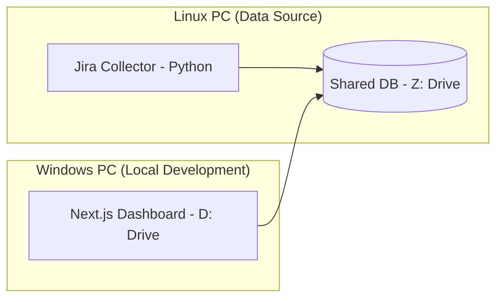

# JiraAnal Web Dashboard

이 프로젝트는 리눅스 보안 환경의 Jira 데이터를 수집하여 윈도우 로컬 환경에서 시각화하는 하이브리드 대시보드 도구입니다.

## 🏗️ 시스템 아키텍처



## 📂 프로젝트 구조 및 관리 절차

소스 코드는 보존과 성능을 위해 분리하여 관리합니다.

1. **소스 관리 (D: Drive)**: 
   - 위치: `D:\works\JiraAnal_Web`
   - 역할: 대시보드 UI 개발, Git 형상 관리 (`https://github.com/mobilitylab-claude/pmworks.git`).
   - 장점: 로컬 드라이브를 사용하므로 `npm install` 및 빌드 속도가 매우 빠르고 안정적입니다.

2. **데이터 공유 (Samba Z: Drive)**:
   - 위치: `Z:\workspace\webApps\JiraAnal_New\data\jira_data.db`
   - 역할: 리눅스 수집기(Python)가 작성한 데이터를 윈도우 웹 앱이 읽어오는 브리지 역할.

## 🚀 운영 가이드

### 1단계: 리눅스에서 데이터 업데이트
워크로그 최신화가 필요할 때 리눅스 서버에서 수집 스크립트를 실행합니다.
```bash
cd z:/workspace/webApps/JiraAnal_New
./run_collector.sh
```

### 2단계: 윈도우에서 대시보드 실행
로컬(D: 드라이브) 폴더에서 개발 서버를 구동합니다.
```powershell
cd D:\works\JiraAnal_Web
npm run dev
```
접속 주소: [http://localhost:3000](http://localhost:3000)

## 🛠️ 개발 시 주의사항
- **DB 경로**: `src/lib/db.ts` 파일에서 `DB_PATH`는 반드시 Z: 드라이브를 바라보도록 유지해야 합니다.
- **Git Push**: 코드 수정 후에는 로컬(D:)에서 Git 명령어를 통해 커밋 및 푸시를 진행하십시오.
- **의존성 설치**: 새로운 패키지를 추가할 때는 네트워크 드라이브(Z:)가 아닌 로컬(D:) 터미널에서 `npm install`을 실행하십시오.
