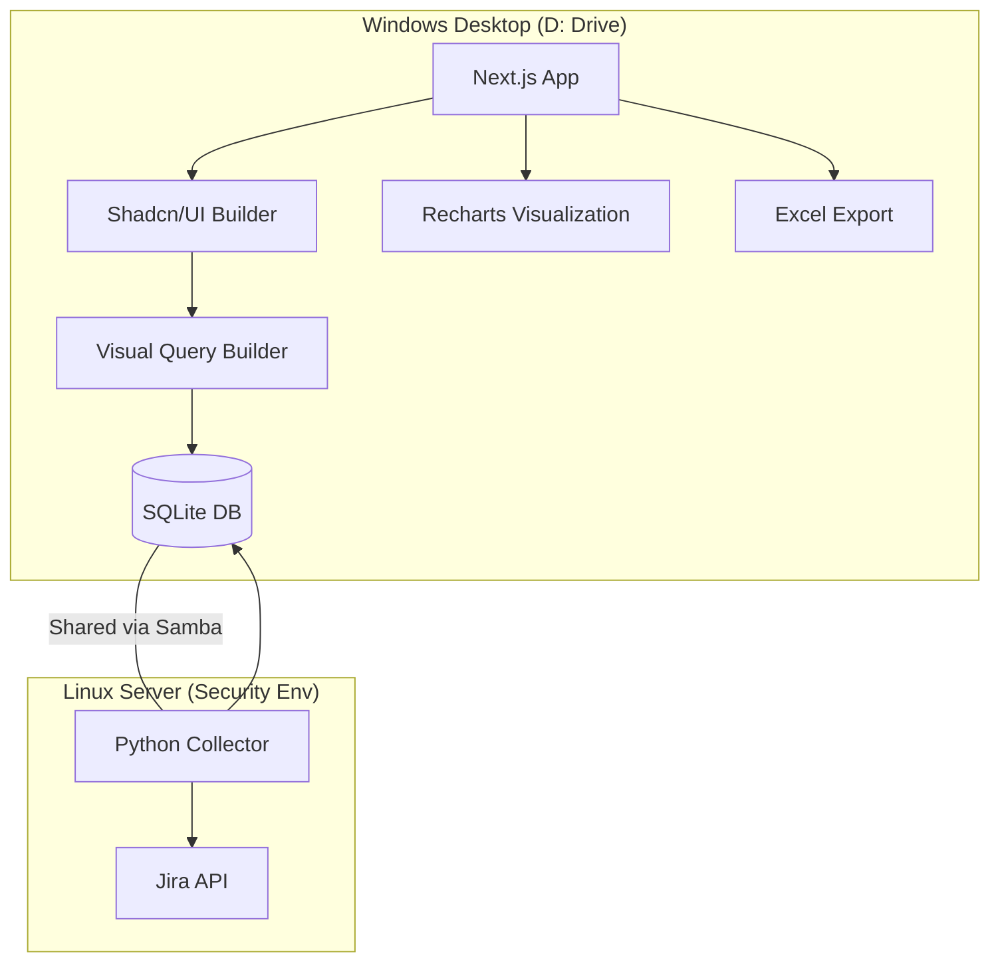
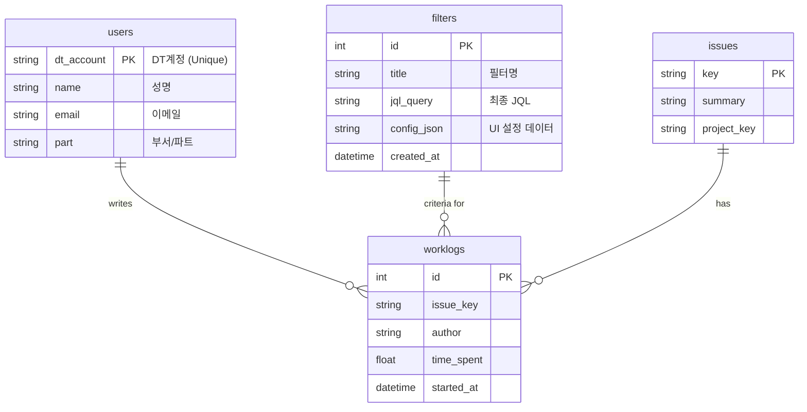
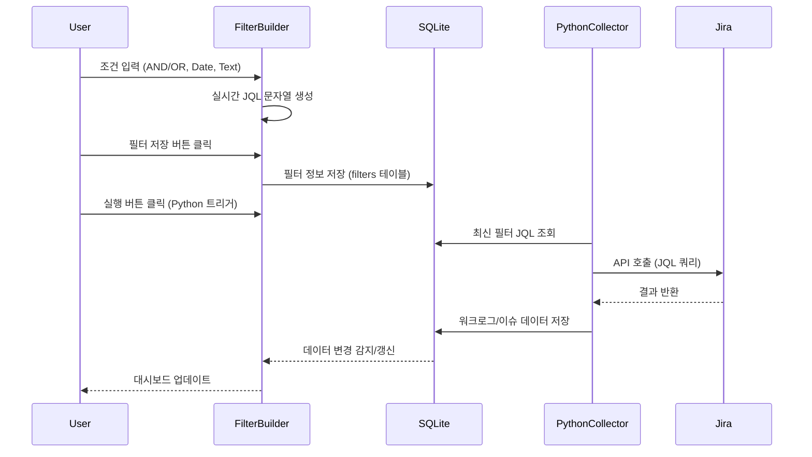

## 1. 시스템 아키텍처 (System Architecture)

```mermaid
graph TD
    subgraph "Windows Desktop (D: Drive)"
        A[Next.js App] --> B[Shadcn/UI Builder]
        B --> C[Visual Query Builder]
        C --> D[(SQLite DB)]
        A --> E[Recharts Visualization]
        A --> F[Excel Export]
    end

    subgraph "Linux Server (Security Env)"
        G[Python Collector] --> D
        G --> H[Jira API]
    end

    D -- "Shared via Samba" --- G
```

## 2. 데이터베이스 설계 (ERD)

```mermaid
erDiagram
    users {
        string dt_account PK "DT계정 (Unique)"
        string name "성명"
        string email "이메일"
        string part "부서/파트"
    }
    filters {
        int id PK
        string title "필터명"
        string jql_query "최종 JQL"
        string config_json "UI 설정 데이터"
        datetime created_at
    }
    worklogs {
        int id PK
        string issue_key
        string author
        float time_spent
        datetime started_at
    }
    issues {
        string key PK
        string summary
        string project_key
    }

    users ||--o{ worklogs : "writes"
    filters ||--o{ worklogs : "criteria for"
    issues ||--o{ worklogs : "has"
```

## 3. 주요 기능 프로세스

### 3.1 JQL 필터 생성 로직

```mermaid
sequenceDiagram
    participant User
    participant UI as FilterBuilder
    participant DB as SQLite
    participant Coll as PythonCollector

    User->>UI: 조건 입력 (AND/OR, Date, Text)
    UI->>UI: 실시간 JQL 문자열 생성
    User->>UI: 필터 저장 버튼 클릭
    UI->>DB: 필터 정보 저장 (filters 테이블)
    User->>UI: 실행 버튼 클릭 (Python 트리거)
    Coll->>DB: 최신 필터 JQL 조회
    Coll->>Jira: API 호출 (JQL 쿼리)
    Jira-->>Coll: 결과 반환
    Coll->>DB: 워크로그/이슈 데이터 저장
    DB-->>UI: 데이터 변경 감지/갱신
    UI-->>User: 대시보드 업데이트
```

## 4. 변경 이력
- 2026-01-14: 초기 설계 수립 및 Mermaid 다이어그램 적용
