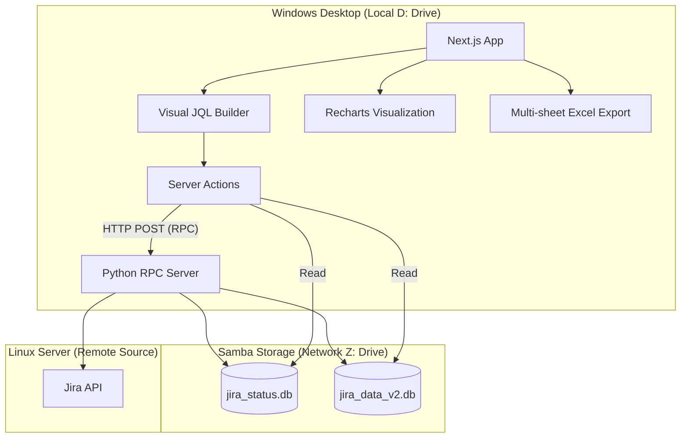

## 1. 시스템 아키텍처 (Hybrid RPC Arch)

## 2. 데이터베이스 설계 (ER v2)

### 2.1 Status DB (`jira_status.db`)
운영 정보 및 수집 관리를 위한 DB입니다.
- **filters**: 저장된 JQL 필터 정의 (UI 상단 '필터 관리'에서 조회)
- **collections**: 수집 회차 정보 (JQL, 수집 시점, 상태, 건수)
- **active_config**: 수집 진행률 및 상태 메시지 실시간 동기화

### 2.2 Data DB (`jira_data_v2.db`)
실제 수집된 Jira 원본 및 통계 데이터입니다.
- **worklogs**: 개별 워크로그 내역 (ID, 이슈키, 작업자, 시간, 시작일 등)
- **issues**: 이슈 정보 (키, 요약, 프로젝트 키)
- **users**: 사용자 정보 (DT계정, 이름, 이메일, 파트)

## 3. 주요 기능 프로세스

### 3.1 실시간 JQL 기반 데이터 수집
1. 웹(Next.js)에서 JQL 입력을 통해 수집 명령을 전달합니다.
2. Server Action이 리눅스 호스트의 Python RPC 서버(Port 5001)로 명령을 전송합니다.
3. Python 서버가 Jira API를 호출하여 데이터를 가져오고, Samba 공유 폴더의 SQLite DB에 실시간으로 작성합니다.
4. 웹 대시보드는 DB의 `active_config`와 `collection_logs`를 주기적으로 읽어와 진행률과 로그를 사용자에게 보여줍니다.

### 3.2 수집 이력 기반 통계 및 엑셀 리포트
1. 수집된 특정 회차(Collection)를 선택하면 `worklogs`와 `issues`를 조인하여 상세 데이터를 구성합니다.
2. 서버 측에서 작업자별/월별 투입 시간을 집계하여 Recharts를 통해 시각화합니다.
3. **엑셀 내보내기**:
    - `xlsx` 라이브러리를 사용하여 4개의 시트(개요, 작업자별, 월별, 상세)를 한 번에 생성합니다.
    - 데이터 타입(Number)을 유지하여 인쇄 및 수식 활용이 용이하도록 처리합니다.

## 4. 변경 이력
- 2026-01-14: 초기 설계 수립 및 Mermaid 다이어그램 적용
- 2026-01-16: RPC 아키텍처 및 멀티 시트 엑셀 내보내기 상세 설계 반영
